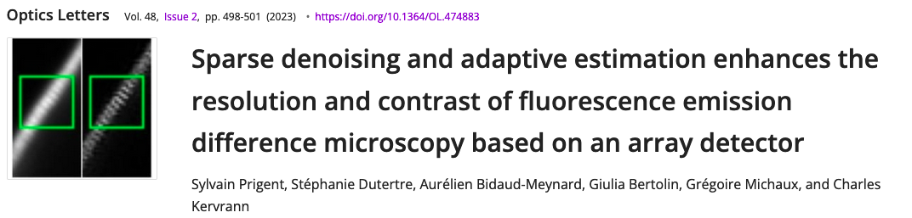

# SAiryscan

SAiryscan is a python proof of concept of the algorithms developed in the publication: [Optic letters](https://opg.optica.org/ol/abstract.cfm?uri=ol-48-2-498&origin=search)




The implementation is based on `PyTorch` for it capabilities of using the GPU if available.

## Documentation

The documentation is available [here](https://sylvainprigent.github.io/sairyscan/about.html).

## Quick start

The easiest way to use the code without modifications is to use de command line interface:

```bash
airyscan -i celegans.czi -r SRegisterPosition -m ISM -o celegans_ism.tiff
```

To build pipeline please refer to the API documentation [guide](https://sylvainprigent.github.io/sairyscan/guide.html)


# For development

## Install dev dependencies

```bash
pip install -r requirements.txt
```

## Run the tests

```bash
pytest sairyscan
```

## Check PEP8

```bash
pylint sairyscan
```

## Build the documentation

The documentation is written with Sphinx. To build is run the commands:

```bash
cd docs
pipenv run sphinx-build -b html ./source ./build
```
