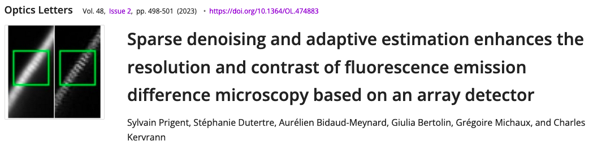

SAiryscan
=========

`SAiryscan` is a python proof of concept of the algorithms developed in the publication 
in `Optic letters <https://opg.optica.org/ol/abstract.cfm?uri=ol-48-2-498&origin=search>`_ 

The implementation is based on `PyTorch` for it capabilities of using the GPU if available.

Quick start
~~~~~~~~~~~

The easiest way to use the code without modifications is to use de command line interface:

.. code-block:: bash

    airyscan -i celegans.czi -r "SRegisterPosition" -m ISM -o celegans_ism.tiff

To build pipeline please refer to the API documentation :doc:`/guide`

